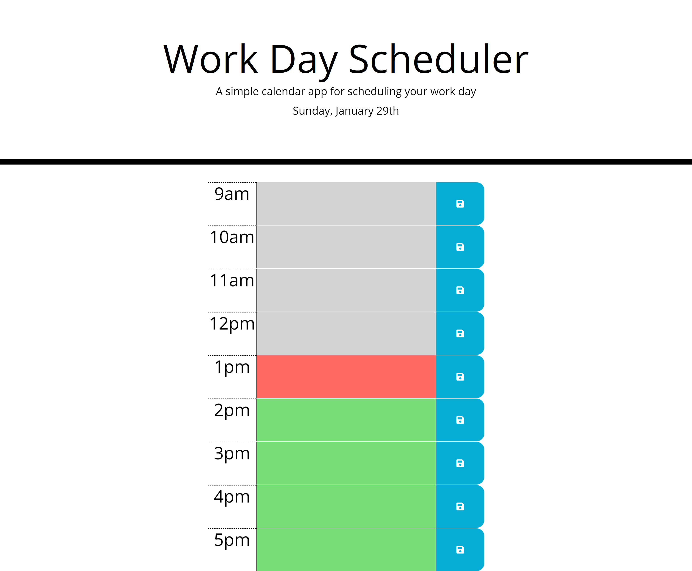

# Planner App

## Summary

A planner app which allows you to enter your appointments/meetings for the current day and saves to local storage so your schedule is available next time you load the page.

## Tech Used

- HTML5
- CSS3
- JavaScript
- jQuery
- moment.js

## Screenshot

## Link to App

[Link to deployed Planner App](https://stevejr86.github.io/BC-Planner-App/)